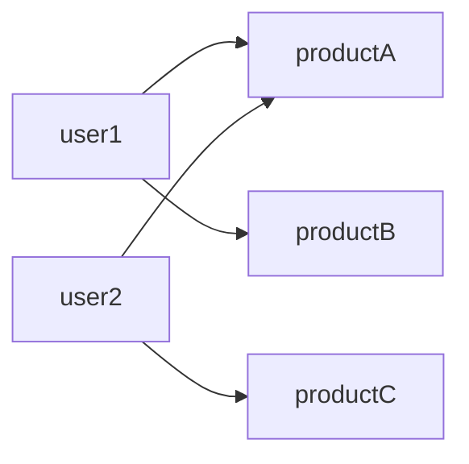

# Problem statement
- Finds products purchased by similar users but not yet purchased by the current user

## Example
```
CREATE (:User {id: 'user1'});
CREATE (:User {id: 'user2'});
CREATE (:Product {id: 'productA'});
CREATE (:Product {id: 'productB'});
CREATE (:Product {id: 'productC'});
CREATE (:Product {id: 'productD'});

MATCH (u:User {id: 'user1'}), (p:Product {id: 'productA'}) CREATE (u)-[:PURCHASED]->(p);
MATCH (u:User {id: 'user1'}), (p:Product {id: 'productB'}) CREATE (u)-[:PURCHASED]->(p);
MATCH (u:User {id: 'user2'}), (p:Product {id: 'productA'}) CREATE (u)-[:PURCHASED]->(p);
MATCH (u:User {id: 'user2'}), (p:Product {id: 'productC'}) CREATE (u)-[:PURCHASED]->(p);
```


